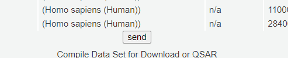

# subbind
computational biohacking

this is 2 second step in making a software that will automate biohackers work, inculding selectivity calculation of substances

the first step was https://chrome.google.com/webstore/detail/subbind/hdlnkhfddbapfdllojdhlepocncbckkp

now need to do:  
-restful API, done/partially!  
-sqlite3 db insert, ongoing  
-selectivity calculation  
-filter  

MIT, but apple logic as admin, and expected to buy later, and can be enforced, i say something doesn't mean ill do it

---------------------------
## LIB USED:  

I use js/node  
Subbind add-on the catch data from bindingdb.org  
Axios as restful api   
sqlite3 as db  

Every js file has function to do like visualiser so can be sub upgraded later  

Bulma as CSS library  
Express.js as web server  

---------------------------
## THE INSTALATION GRAPH:  
subbind as addon get binding list of a substance

you click send button  

a node.js software (we are developing rightnow) should be lestning on port 80, getting data as restful API (restful.js)

he push data into bio.db

hint: you can see the table using SQLiteStudio in halpfull tools folder in this project

median-binding.js lib should calculate median binding of varios papers say's and put it in other tabe inside bio.db

selectivity.js lib should calculate selectivity, and put it in other table in bio.db

visualiser.js self made lib to view data in index.html  
specification: you choose receptors you want to interact with, and the tool search every substance combination it have, to give the best, based on selectivity, affordability (OTC, FDA approved or RC).