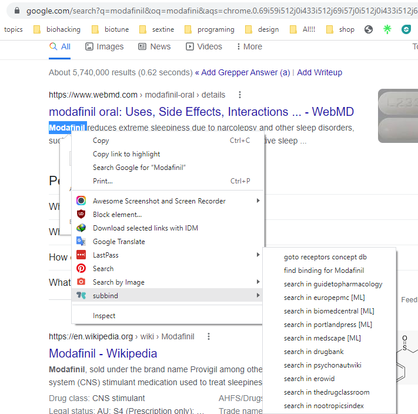

# clearer substance binding for biohackers 

bindingdb.org is a meta search engine that fetch data from other search engine like PSPP,
i tried to find a easy way to know the median binding of a substance using bindingdb.org but the data was hard to use , so i developed a addon that will scrap the data and give you easy way to know the median binding of any substance  

how to use:  
-select a substance name from any site (eg, wikipedia) then right click and choose "find binding for ****"   
-or click addon icon for specific name search  

added features to bindingdb.org:
- [x] table sorting
- [x] automatically detect agonist/antagonist
- [x] convert scientific numbers to normal
- [x] remove additions text keep nM
- [x] setting efficacy
- [x] delete non human study if human study is available for specific receptor
- [x] add efficacy in ki from IC/EC50
- [x] deleting other value if ki available
- [x] fetch all data instead of 50 everytime
- [x] give alert when data was not fully loaded

- [x] adding medical literature
- [x] adding RCD
- [x] adding "search in" guidetopharmacology, drugbank, psychonautwiki, erowid, thedrugclassroom, nootropicindex

## aiming:
- [ ] myrcene Ki OR IC50 OR EC50 to google
- [ ] auto scihub switch
- [ ] selectivity.
https://sci-hub.hkvisa.net/ 
wosonhj.com